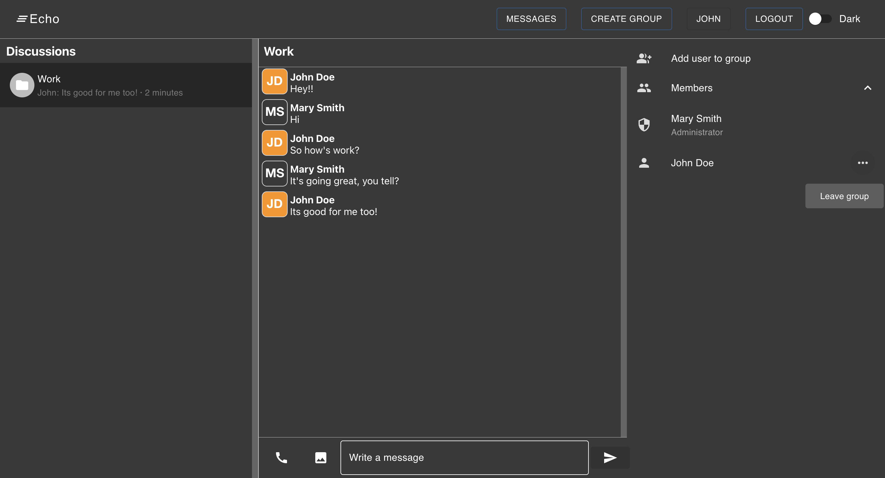
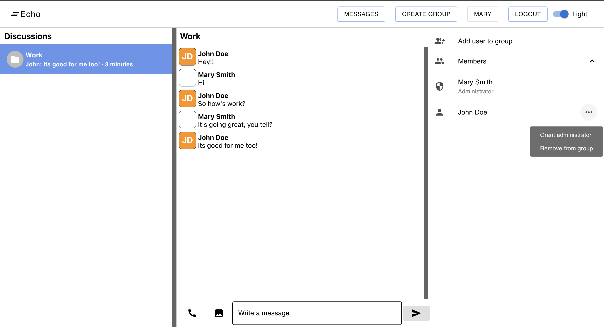

# Echo - Group Chat Application

Echo is a dynamic group chat application powered by Spring Boot Java for the backend and React JavaScript for the frontend. Leveraging MySQL for database management and WebSocket technology for real-time communication, it offers seamless interaction and instant messaging within groups.

## Feautures

* Real-time chat updates for instant communication.
* User-friendly sign-in/sign-out functionality.
* Sleek UI design for an enjoyable experience.
* Streamlined group administration with customizable permissions.
* Intuitive features tailored for efficient group interaction.

## Screenshots

## To run this app

### Frontend
Run yarn build and then yarn start

### Backend
Create appropriate database and then run the application
